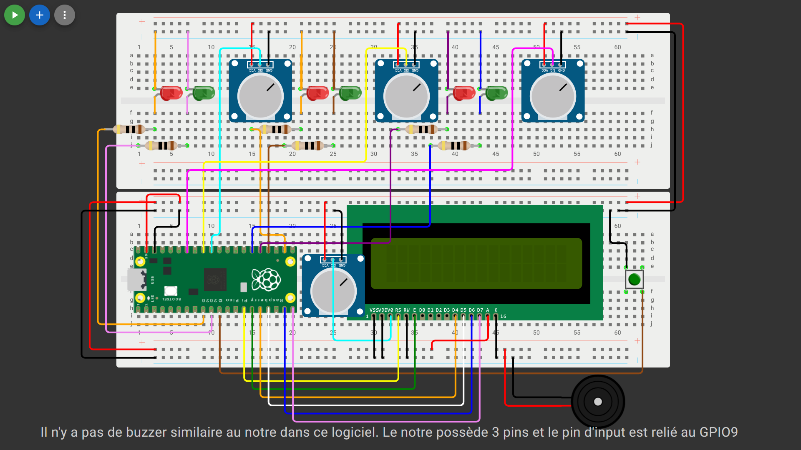

# 🔐 L'Énigme — Coffre-Fort à Combinaison

> **Projet informatique** | Thomas Monin & Anna Caraulean | 2025–26  
> Prototype robotique à base de Raspberry Pi Pico H — Trouvez la bonne combinaison du coffre !

---

## 📋 Table des matières

1. [Description du projet](#description-du-projet)
2. [Documentation technique](#documentation-technique)
   - [Schéma de câblage](#schéma-de-câblage)
   - [Liste des composants](#liste-des-composants)
   - [Explication du code](#explication-du-code)
   - [Trame du projet](#trame-du-projet)
3. [Nouveaux composants](#nouveaux-composants)
   - [Buzzer passif SE044](#1-buzzer-passif-se044)
   - [Écran LCD COM-LCD16X2](#2-écran-lcd-com-lcd16x2)
4. [Sources](#sources)

---

# Description du projet

**L'Énigme** est un coffre-fort électronique interactif. Le joueur doit régler trois potentiomètres afin de reproduire une combinaison secrète composée de trois chiffres.

Le système donne un retour visuel (LEDs + écran LCD) et sonore (buzzer) à chaque tentative.

**Combinaison par défaut : `1 – 2 – 2`**

## Fonctionnalités principales

- 🎛️ Saisie de la combinaison via trois potentiomètres
- 💡 Retour visuel par LEDs vertes (correct) et rouges (incorrect)
- 🔊 Retour sonore par buzzer passif
- 🖥️ Affichage en temps réel sur écran LCD 16×2
- ⚠️ Avertissement après 5 erreurs consécutives
- 🔄 Possibilité de définir une nouvelle combinaison par appui long sur le bouton

---

# Documentation technique

## Schéma de câblage

> *Schéma non contractuel pour raisons de clarté : certains câbles ne sont pas représentés et la position de certains composants peut différer du montage réel.*



### Correspondance des broches (GPIO → Composant)

| GPIO | Composant | Rôle |
|------|-----------|------|
| GP26 (ADC0) | Potentiomètre 1 | Lecture chiffre 1 |
| GP27 (ADC1) | Potentiomètre 2 | Lecture chiffre 2 |
| GP28 (ADC2) | Potentiomètre 3 | Lecture chiffre 3 |
| GP9 | Buzzer passif (S) | Signal sonore |
| GP7 | LED verte 1 | Validation chiffre 1 |
| GP6 | LED rouge 1 | Erreur chiffre 1 |
| GP18 | LED verte 2 | Validation chiffre 2 |
| GP17 | LED rouge 2 | Erreur chiffre 2 |
| GP20 | LED verte 3 | Validation chiffre 3 |
| GP19 | LED rouge 3 | Erreur chiffre 3 |
| GP8 | Bouton poussoir | Validation / Nouveau code |
| GP10–GP15 | Écran LCD | Affichage |
| 3V3 | Composants | Alimentation |
| GND | Tous composants | Masse |

---

## Liste des composants

| Composant | Référence | Quantité |
|-----------|-----------|----------|
| Carte microcontrôleur | Raspberry Pi Pico H | 1× |
| Écran LCD 16×2 ⭐ *(nouveau)* | COM-LCD16X2 | 1× |
| Buzzer passif ⭐ *(nouveau)* | SE044 | 1× |
| Potentiomètre | Piher PT15LV | 4× |
| LED verte | Kingbright L-53G3C | 3× |
| LED rouge | Kingbright L-53SRD | 3× |
| Résistance 220 Ω ¼W | Résistance carbone | 6× |
| Bouton poussoir | 6×6×6mm Tact Push Button | 1× |
| Câbles de connexion | — | 43× |

---

### Explication du code

Le programme est écrit en **MicroPython** pour la Raspberry Pi Pico H.
```python
from machine import Pin, ADC, PWM
import utime
import time

#LCD
#broches écran LCD
rs = Pin(10, Pin.OUT)
e = Pin(11, Pin.OUT)
d4 = Pin(12, Pin.OUT)
d5 = Pin(13, Pin.OUT)
d6 = Pin(14, Pin.OUT)
d7 = Pin(15, Pin.OUT)

#signal de validation LCD
def pulse_enable():
    e.value(1); utime.sleep_us(1)
    e.value(0); utime.sleep_us(100)

#envoi des données par blocs de 4 bits
def send_nibble(data):
    d4.value((data>>0)&1)
    d5.value((data>>1)&1)
    d6.value((data>>2)&1)
    d7.value((data>>3)&1)
    pulse_enable()

#envoi d'une commande ou d'un caractère
def send_byte(data, mode):
    rs.value(mode)
    send_nibble(data>>4)
    send_nibble(data & 0x0F)

#commande LCD
def lcd_command(cmd):
    send_byte(cmd,0)
    utime.sleep_ms(2)

#écriture LCD
def lcd_data(data):
    send_byte(data,1)
    utime.sleep_ms(2)

#initialisation LCD
def lcd_init():
    utime.sleep_ms(20)
    send_nibble(0x03); utime.sleep_ms(5)
    send_nibble(0x03); utime.sleep_us(100)
    send_nibble(0x03)
    send_nibble(0x02)
    lcd_command(0x28)
    lcd_command(0x0C)
    lcd_command(0x06)
    lcd_command(0x01)

#affichage texte LCD
def lcd_print(txt):
    for c in txt:
        lcd_data(ord(c))

#effacer écran LCD
def lcd_clear():
    lcd_command(0x01)

#COMPOSANTS

#leds vertes et rouges
led_v1 = Pin(7, Pin.OUT)
led_r1 = Pin(6, Pin.OUT)

led_v2 = Pin(18, Pin.OUT)
led_r2 = Pin(17, Pin.OUT)

led_v3 = Pin(20, Pin.OUT)
led_r3 = Pin(19, Pin.OUT)

#potentiomètres
pot1 = ADC(26)
pot2 = ADC(27)
pot3 = ADC(28)

#bouton
bouton = Pin(8, Pin.IN, Pin.PULL_UP)

#buzzer
buzzer = PWM(Pin(9))

#VARIABLES

#code à trouver
combinaison = [1,2,2]

#nombre d'essais ratés
tentatives = 0

#dernières valeurs affichées
last_vals = [0,0,0]

#FONCTIONS

#buzzer
def beep(f,d):
    buzzer.freq(f)
    buzzer.duty_u16(30000)
    time.sleep(d)
    buzzer.duty_u16(0)

#lecture potentiomètre
#convertit la position en valeur 1 2 ou 3
def lire_pot(p):
    v = p.read_u16()
    if v < 21845: return 1
    elif v < 43690: return 2
    else: return 3

#éteindre toutes les leds
def reset_leds():
    for led in [led_v1,led_r1,led_v2,led_r2,led_v3,led_r3]:
        led.value(0)

#démarrage LCD
lcd_init()
lcd_clear()

#CONSIGNE
print("But du jeu : trouver la bonne combinaison de 3 chiffres en tournant les potentiomètres. Appuyez brievement sur le bouton pour valider le code ou maintenez-le plus d'une seconde pour enregistrer un nouveau code.")

#BOUCLE PRINCIPALE
while True:

#lecture des 3 potentiomètres
    vals = [lire_pot(pot1), lire_pot(pot2), lire_pot(pot3)]

#AFFICHAGE LIVE
#met à jour l'écran seulement si une valeur change
    for i in range(3):
        if vals[i] != last_vals[i]:
            lcd_clear()
            lcd_print("Chiffre "+str(i+1)+"="+str(vals[i]))
            last_vals = vals[:]

#BOUTON
    if bouton.value() == 0:

#mesure du temps d'appui
        t0 = time.ticks_ms()
        while bouton.value() == 0:
            time.sleep(0.05)

        duree = time.ticks_diff(time.ticks_ms(), t0)

#RESET
#appui long pour enregistrer un nouveau code
        if duree >= 1000:

            combinaison = vals[:]
            tentatives = 0

#animation leds et buzzer
            for i in range(5):

                led_v1.value(1); led_r1.value(1)
                led_v2.value(1); led_r2.value(1)
                led_v3.value(1); led_r3.value(1)

                beep(1479, 0.1)

                led_v1.value(0); led_r1.value(0)
                led_v2.value(0); led_r2.value(0)
                led_v3.value(0); led_r3.value(0)

                time.sleep(0.1)

#affichage du nouveau code
            lcd_clear()
            lcd_print("Nouveau code:")
            lcd_command(0xC0)

            code_str = str(combinaison[0]) + "-" + str(combinaison[1]) + "-" + str(combinaison[2])
            lcd_print(code_str[:16])

#VALIDATION
#appui court pour tester le code
        else:

            reset_leds()
            correct = True

#listes des leds vertes et rouges
            leds_v = [led_v1,led_v2,led_v3]
            leds_r = [led_r1,led_r2,led_r3]

#affichage du code testé
            lcd_clear()
            lcd_print("Code:")
            lcd_command(0xC0)

            affichage = ""

#vérification des 3 chiffres
            for i in range(3):

                affichage += str(vals[i])
                if i < 2:
                    affichage += "-"

                lcd_command(0xC0)
                lcd_print(affichage)

#bonne valeur
                if vals[i] == combinaison[i]:
                    leds_v[i].value(1)
                    beep(2959, 0.2)  
                else:
#mauvaise valeur
                    leds_r[i].value(1)
                    beep(369, 0.2)   
                    correct = False

                time.sleep(0.5)

            lcd_clear()

#code correct
            if correct:
                lcd_print("Correct !")
                tentatives = 0

#mélodie victoire
                for i in range(5):
                    beep(2959, 0.1)
                    time.sleep(0.1)
                
            else:

#code faux
                tentatives += 1

                if tentatives >= 5:
                    lcd_print("T'abuse non")
                else:
                    lcd_print("Essaye encore")

#attend que le bouton soit relâché
        while bouton.value() == 0:
            time.sleep(0.05)

    time.sleep(0.1)
```

---

### Trame du projet

Le but du programme est de trouver une combinaison composée de trois chiffres (par défaut : `1 - 2 - 2`).

Chaque chiffre est contrôlé par un potentiomètre, qui peut prendre trois valeurs possibles selon l’angle : `1`, `2` ou `3`. Le joueur doit donc régler les trois potentiomètres afin de reproduire le bon code.

Lorsque le bouton est pressé brièvement, le système vérifie la combinaison entrée. Chaque chiffre est analysé séparément :

- si le chiffre est correct, une LED verte s’allume et un son aigu est joué par le buzzer ;
- si le chiffre est faux, une LED rouge s’allume et un son grave est émis.

L’écran LCD affiche également les chiffres sélectionnés ainsi que le résultat de la tentative.

Si la combinaison est correcte, un message de validation apparaît accompagné de plusieurs bips aigus. Sinon, le joueur doit réessayer.

Après cinq erreurs consécutives, un message d’avertissement s’affiche.

Le programme possède aussi une fonction de réinitialisation du code. Lorsque le bouton est maintenu appuyé pendant plus d’une seconde, la valeur actuelle de chaque potentiomètre devient alors la nouvelle combinaison.

Toutes les LEDs clignotent alors ensemble et un son de confirmation est joué plusieurs fois. L’écran affiche ensuite le nouveau code enregistré.

---

## Nouveaux composants

### 1. Buzzer passif SE044

**Référence :** SE044 — IDUINO / OpenPlatform

#### Fonctionnement technique

Contrairement à un buzzer *actif* (qui émet un son fixe dès qu'il est alimenté), le **buzzer passif SE044** nécessite un signal carré externe pour vibrer et produire du son. C'est le microcontrôleur qui génère ce signal via une sortie PWM.

- **3 broches :** `S` (signal PWM), `+` (alimentation 3.3V), `-` (GND)
- **Broche signal :** reliée au **GPIO9** de la Pico
- **Principe :** plus le signal change d'état (haut/bas) rapidement → plus le son est **aigu** ; plus il est lent → plus le son est **grave**
- **Fréquence utilisée :** 300 Hz (grave / erreur) à 1500 Hz (aigu / validation)

```
Pico GP9 ─ [ Signal PWM ] ──► S [SE044]  + ──► 3V3
                                         - ──► GND
```

#### Rôle dans le projet

Le buzzer est le **retour sonore** du coffre-fort, permettant au joueur de comprendre le résultat sans regarder l'écran :

| Événement | Son | Fréquence |
|-----------|-----|-----------|
| Chiffre correct | Aigu bref | ~1500 Hz |
| Chiffre incorrect | Grave | ~300 Hz |
| Code trouvé (victoire) | Mélodie montante | 800–2000 Hz |
| Réinitialisation code | 3 bips moyens | ~800 Hz |

---

### 2. Écran LCD COM-LCD16X2

**Référence :** COM-LCD16X2 — Joy-IT / SIMAC Electronics

#### Fonctionnement technique

L'écran est un **afficheur alphanumérique 16 caractères × 2 lignes** basé sur le contrôleur standard **HD44780**, compatible avec de nombreuses bibliothèques MicroPython.

- **Interface :** 4 bits de données (D4–D7) + RS + E → économise les GPIO
- **Rétroéclairage :** LED bleue intégrée (contrôlable via broche `A/K`)
- **Contraste :** réglé par le 4e potentiomètre (diviseur de tension sur `V0`)
- **Bibliothèque utilisée :** `lcd_api` + driver HD44780 pour MicroPython

#### Rôle dans le projet

L'écran est l'**interface visuelle principale** du coffre :

| Moment | Affichage |
|--------|-----------|
| En attente | `1 - 2 - 2` (valeurs des potentiomètres) |
| Vérification réussie | `Correct !` |
| Vérification échouée | `Essaye encore` |
| 5 erreurs | `T'abuse non` |
| Réinitialisation | `Nouveau code: X-X-X` |

---

## Sources

- IDUINO. (s. d.). *Passive Buzzer SE044* [Fiche technique]. OpenPlatform. <http://www.openplatform.cc>
- SIMAC Electronics GmbH. (2022, 7 mars). *16x2 LCD Module COM-LCD16X2* [Fiche technique]. Joy-IT. <https://joy-it.net>
- SIMAC Electronics GmbH. (2022, 7 mars). *16x2 LCD Modul* [Manuel d'utilisation]. Joy-IT. <https://joy-it.net>
- Piher Sensors & Controls. (s. d.). *PT15LV Carbon Potentiometer* [Fiche technique]. Meggitt. <https://www.piher.net>
- Raspberry Pi Ltd. (2023). *Raspberry Pi Pico Datasheet*. <https://datasheets.raspberrypi.com/pico/pico-datasheet.pdf>

---

*Projet réalisé dans le cadre du cours d'informatique — CECG de Staël, 2025–26*
